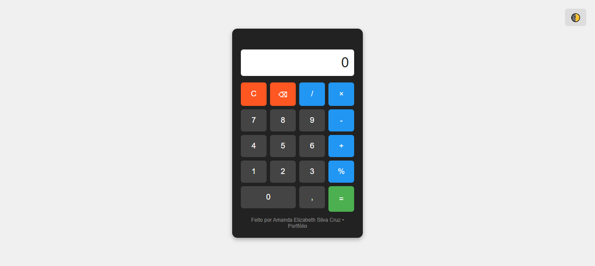
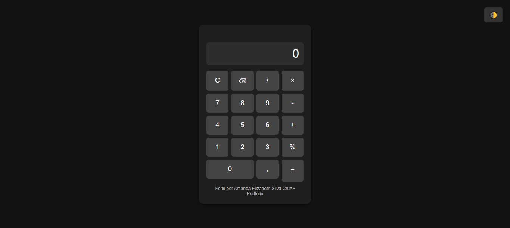

# 🧮 Calculadora Web

Calculadora funcional desenvolvida com tecnologias básicas da web, focada em usabilidade, responsividade e experiência do usuário. 
Conta com todas as operações essenciais, tratamento de erros, histórico salvo e troca de tema. 
Ideal para uso diário ou como portfólio de desenvolvimento web.

---

## 📌 Funcionalidades

- Operações básicas: soma, subtração, multiplicação e divisão
- Cálculo de porcentagem
- Tratamento de erros: divisão por zero, valores inválidos e entrada incorreta de dados
- Histórico de cálculos visível na tela durante o uso
- Histórico salvo automaticamente no navegador (não se perde ao recarregar ou fechar a página)
- Funciona com clique nos botões **e** também com teclado do computador
- Tema claro e escuro com troca de aparência em um clique
- Design responsivo: adaptado automaticamente para celular, tablet e computador

---

## 📦 Estrutura do Projeto

Organização dos arquivos e suas funções:

calculadora-web/
├── imagens/ # Pasta com capturas de tela do projeto
│ ├── calculadora-claro.png
│ └── calculadora-escuro.png
├── index.html # Estrutura da página, elementos visuais e ligação com arquivos externos
├── style.css # Estilos visuais, cores, tema claro/escuro, responsividade e formatação
├── script.js # Lógica dos cálculos, tratamento de erros, histórico e eventos de interação
└── README.md # Documentação completa do projeto (esse arquivo)

---

## 🎨 Screenshots

Visual do projeto em diferentes modos:

---

## 🔗 Live Demo

Veja o projeto funcionando online:
🔗 **[Acessar Demonstração](https://amandalizzie.github.io/Calculadora-portfolio/)**

---

## 🛠️ Detalhes Técnicos

- **Versão do JavaScript**: ES6+ (utilização de `let`, `const`, manipulação de DOM moderna, funções e tratamento de eventos)
- **Armazenamento**: `localStorage` para salvar histórico sem necessidade de banco de dados
- **Navegadores suportados**: Google Chrome, Mozilla Firefox, Microsoft Edge, Safari (versões recentes)
- **Testes**: Testes manuais realizados para todas as funcionalidades e cenários de erro
- **Compatibilidade**: Funciona em telas de todos os tamanhos, de celulares a monitores grandes

---

## 📝 Melhorias Futuras

Funcionalidades planejadas para próximas versões:

- Operações avançadas: raiz quadrada, potência e radiciação
- Modo científico com funções trigonométricas e logarítmicas
- Atalhos de teclado personalizáveis
- Opção de exportar ou limpar o histórico de cálculos
- Registro de data e hora em cada operação salva
- Suporte a modo de alto contraste para acessibilidade

---

## 📄 Licença

Este projeto está sob a licença **MIT**.  
Você pode usar, modificar e distribuir o código livremente, desde que mantenha a referência ao autor original.

---

Desenvolvido por Amanda Elizabeth Silva Cruz — 💻 Sempre aprendendo e evoluindo.
